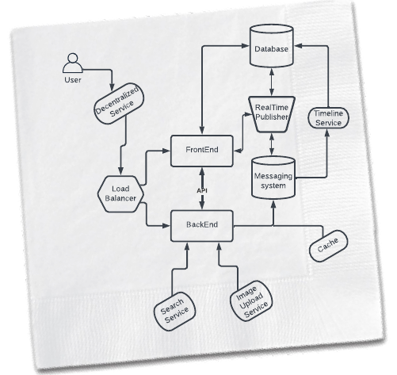
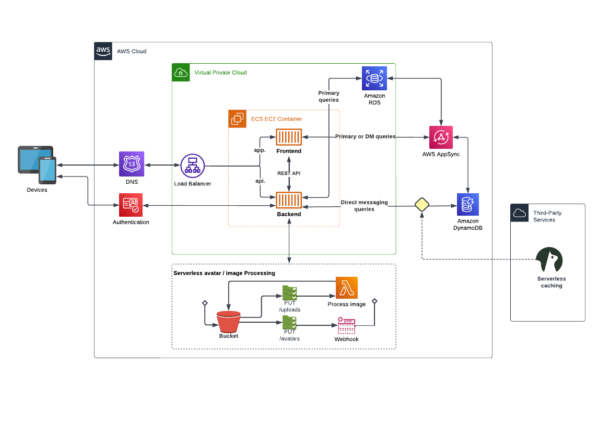
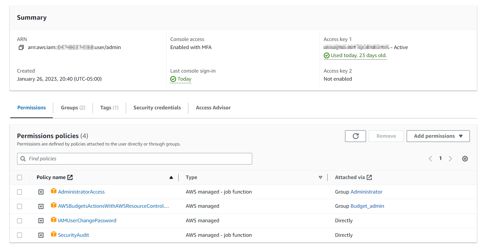
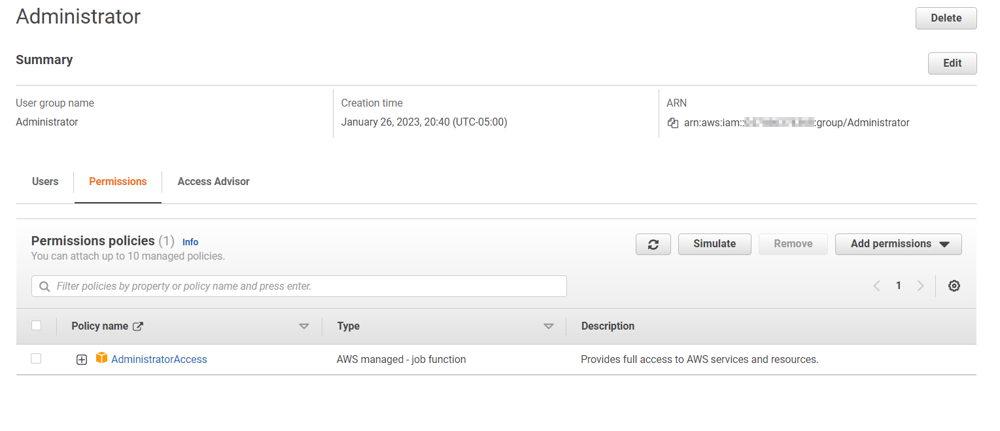
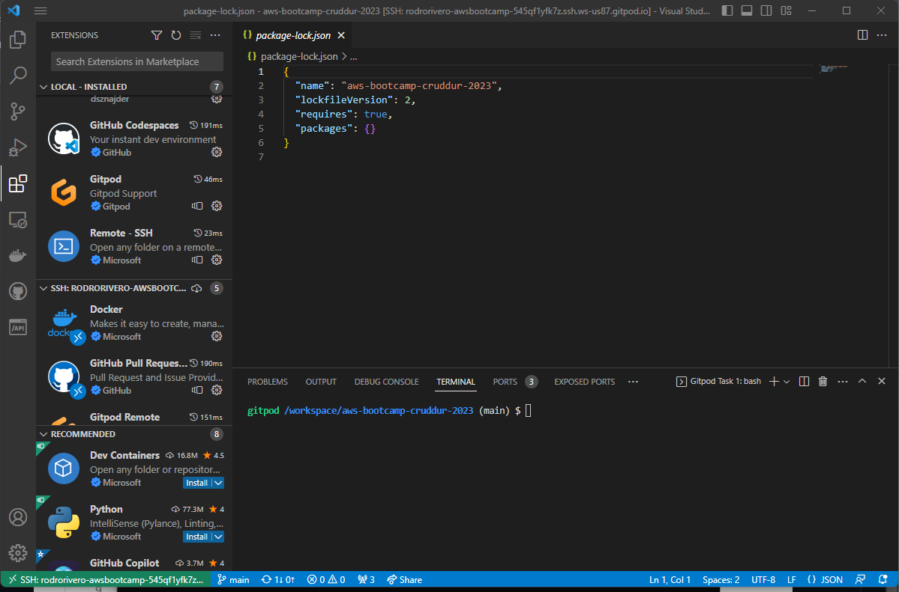
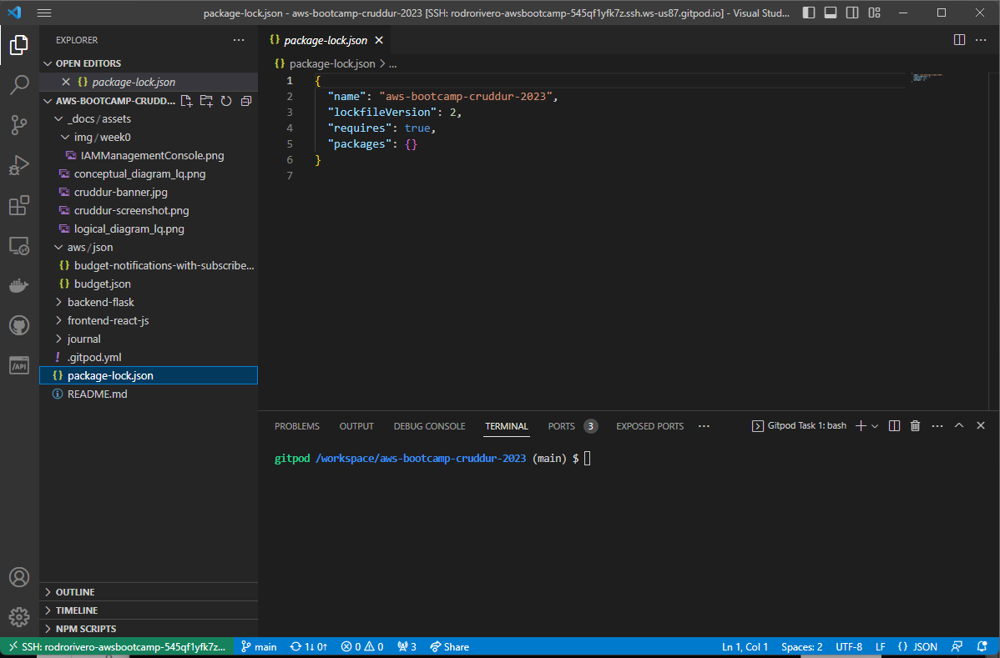
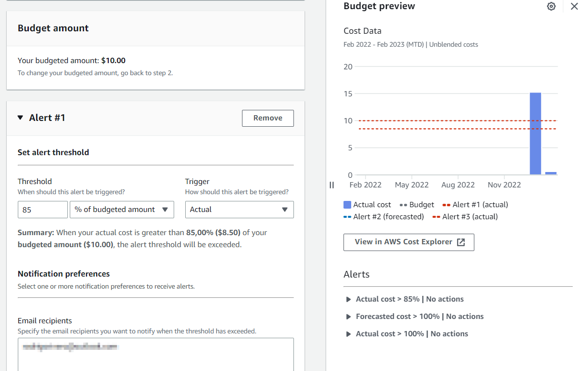

# Week 0 — Billing and Architecture
## Required Homeworks/Taks

### Architecture Diagrams:

Conceptual and architectural diagrams are important for communicating complex ideas in a visual way. Conceptual Diagrams helps non technical people understand high-level concepts and Logical Diagrams help to clarify technical details of a system, identify potential issues, and facilitate collaboration and communication between collegues.

For our project, a social network with a similar concept than Twitter, we will be using cognito as an authentication system, an application load balancer for out front-end and back-end (since we will be allowing users to access the bak-end also), 2 databases: one relational and one non relational dabase both communicated through a realtime publisher, a cache service for our direct messaging queries, a search service and  image upload service for our backend.

> Conceptual Diagram: Represents a virtual napkin in which the architecture was originally planned:

<br>
[Link to Lucidchart](https://lucid.app/lucidchart/8ab7b0e9-dc68-44a1-8411-61ff335cefcd/edit?viewport_loc=1197%2C326%2C2501%2C1180%2C0_0&invitationId=inv_d5f80eb6-d1d6-4b37-99b0-d9b0189f442c)

> Logical Diagram: Stating the technical details of the proposed landscape:


[Link to Lucidchart](https://lucid.app/lucidchart/9d023106-8c25-44b9-aea3-fe76d93b4a6b/edit?viewport_loc=-110%2C139%2C1844%2C870%2C0_0&invitationId=inv_6eeedffd-ff47-4074-bbcb-03c631896d20) 

### Create Admin user, generate AWS credentials & enable MFA:

It is recommended not to use the root user in AWS because it has full administrative access to all AWS services and resources, and using it goes against the principle of least privilege. Instead, it is a best practice to create individual IAM users with appropriate permissions for each role. Since this is a small project we will only need a few accounts, for permforming configurations I created a user called admin and add it to Administrator users group which has all the required authorization for configuring any service on AWS.

In order to enhance the security it's recommended to add an extra layer of authentication, in this case we enabled MFA using Microsoft Authenticator which asks for a machine generated 6-digit code every time you sign in or perform sensitive actions. 

> IAM Management / Users: Screenshot showing the name of the user and the current policies assigned to it and the MFA activated:



> IAM Management / User Groups: Screenshot showing the user groups and the group policy:
 


### Gitpod and Github configuration on VScode:

For ease of access and better control of the IDE, I followed the instructions on: [GitPod - VS Code Desktop](https://www.gitpod.io/docs/references/ides-and-editors/vscode) to configure GitPod and VSCode on my local computer which allows me to pull/push and commit changes made to my git repository.

> VSCode: Screenshot showing the required extensions to enable the integration:




> VSCode: Screenshot showing the successfully retrieval of the repository and gitpod terminal enabled:




### AWS CLI installation:

To install the AWS CLI on Linux, we need to make sure to download the required dependencies, run the command to install the AWS CLI, verify the installation, and configure the AWS CLI with your access keys and settings.

> AWS CLI installation - Code used for linux x86 systems:

```
$ curl "https://awscli.amazonaws.com/awscli-exe-linux-x86_64.zip" -o "awscliv2.zip"
unzip awscliv2.zip
sudo ./aws/install
```

After installation we will get the confirmation message: *"You can now run: /usr/local/bin/aws --version"*

Next we configured the environmental variables and persited them in gitpod:

> AWS CLI - environmental variables:


To test we executed the command: *"aws sts get-caller-identity"* which is basically a *"whoami"* for AWS CLI

> AWS CLI - environmental variables:


### Create a Billing and Budget Alarm:

A Budget and Billing Alarm in AWS helps you monitor and manage your AWS costs and usage. It alerts you when your costs or usage exceed certain thresholds, helping you avoid unexpected charges and prevent your account from being suspended or terminated.

Using JSON files and AWS CLI I created a budget in AWS with alerts to inform me when the threshold is at 85% and 100% fullfiled:

Example json code:
```

    "BudgetLimit": {
        "Amount": "10",
        "Unit": "USD"
    },
    "BudgetName": "My AWs Bootcamp Budget",
    "BudgetType": "COST",
    "CostFilters": {
        "TagKeyValue": [
            "user:Key$value1",
            "user:Key$value2"
        ]
    },
    "CostTypes": {
        "IncludeCredit": true,
        "IncludeDiscount": true,
        "IncludeOtherSubscription": true,
        "IncludeRecurring": true,
        "IncludeRefund": true,
        "IncludeSubscription": true,
        "IncludeSupport": true,
        "IncludeTax": true,
        "IncludeUpfront": true,
        "UseBlended": false
    },
    "TimePeriod": {
        "Start": 1477958399,
        "End": 3706473600
    },
    "TimeUnit": "MONTHLY"
  }
```

> Budget and Billing - Budget created:


> Budget and Billing - Budget Alert at triggered at 85% of the threshold:



## Summary
- [x] Watched all the instructional videos
- [x] Recreated conceptual and logical diagrams
- [x] Create an admin user, generate AWS credentials and enable MFA
- [x] Installed AWS CLI	
- [x] Create a Billing Alarm and a budget
